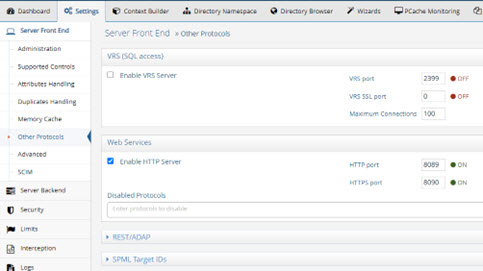
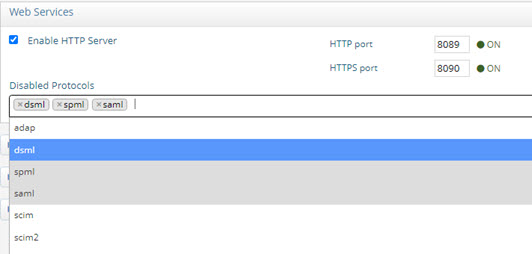
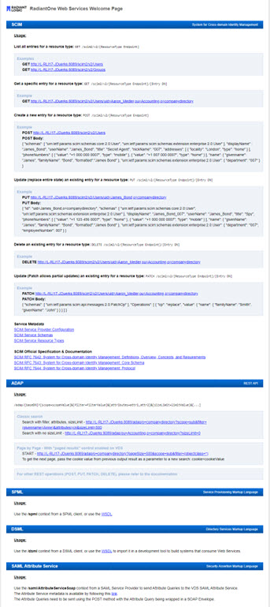

# Overview

In addition to handling LDAP and SQL requests for data stored in RadiantOne Universal Directory stores or Persistent Cache, the RadiantOne service can also respond to Directory Service Markup Language (DSML) and Service Provisioning Markup Language (SPML), SCIM (System for Cross-domain Identity Management), REST requests via HTTP/SOAP, and SAML attribute queries.

Since RadiantOne supports the standard LDAP v3 protocol and operations, and this API is well documented by the industry, this guide focuses solely on the Web Services APIs available.

>[!note]
>Details on the SQL interface available in RadiantOne can be found in the VRS Guide.

The HTTP interface is enabled by default. The default ports for HTTP and HTTPS are 8089 and 8090 respectively. These are the ports the RadiantOne service accepts web service requests on. To modify the ports for HTTP/HTTPS access, go to the Main Control Panel > Settings tab >Server Front End section > Other Protocols sub-section. If changes are made to these settings, save the configuration, and restart the RadiantOne service (on all nodes if deployed in a cluster).

>[!note]
>You can enable both secure and non-secure ports if your corporate security policy allows for this. This way, clients may choose to use either one.

 
Figure 1: Other Protocols Section

# Disabling Protocols/Endpoints

You can disable any HTTP/HTTPS protocols/endpoints that are not used by clients from the Web Services section. Click in the Disabled Protocols property to reveal a drop-down list of options. 

>[!note]
>The LDAP option is legacy (replaced by ADAP) and includes the following endpoints: /ldap/html, /ldap/xml/ ldap/json/ and /vcs.   The monitor option excludes the following servlets /ping, /repmon, and /monitor.   If you disable “adap”, the Directory Browser tab in the Main Control Panel will not work anymore since it is an ADAP client to the RadiantOne service.

 
Figure 2: Disabled Protocols Options

# Accessing the Web Services over SSL (HTTPS)

The server certificate used for HTTPS communication is the one configured on the Server Control Panel -> Settings tab. Click “Manage” next to Server Certificate. If this certificate has been signed by a Certificate Authority (CA) known by the client, then HTTPS communication should work without further configuration.

If this certificate has been self-signed or signed by a CA not known by the client, the client should have the public key certificate imported into their keystore before trying to communicate with the RadiantOne service via HTTPS.

You can export the server certificate for the client’s use by viewing the certificate and clicking Save to File. Browse to a location and enter a certificate file name.

>[!note]
>If you have deployed RadiantOne in a cluster, each node has its own server certificate.

Send the certificate (RadiantOne server public certificate) file to the client machine(s), which communicates via SSL with the RadiantOne service. For example, Java clients generally store this file in the <Java_Home>/lib/security/cacerts directory. 

# Expert Mode

Some settings in the Control Panel are accessible only in Expert Mode. To switch to Expert Mode, click the Logged in as, (username) drop-down menu and select Expert Mode. 

 
>[!note]
>The Main Control Panel saves the last mode (Expert or Standard) it was in when you log out and returns to this mode automatically when you log back in. The mode is saved on a per-role basis.

# Accessing the Web Services Welcome Page

You can access the welcome page by opening a browser and typing the following URL. 

`http[s]://host[:port]`

i.e. `http://localhost:8089`

This displays the welcome screen and shows the supported services.

>[!note]
>In order for the SCIM examples shown below to work properly, SCIM resource types must be created in RadiantOne. Go to the Main Control Panel > Settings Tab > Server Front End section > SCIM sub-section. On the Resource Types tab, create a new resource type named Users and another named Groups. Save the configuration. See [Chapter 4](04-scim.md) for more information on configuring SCIM resource types. 

 
Figure 3: RadiantOne Web Services Welcome Page
